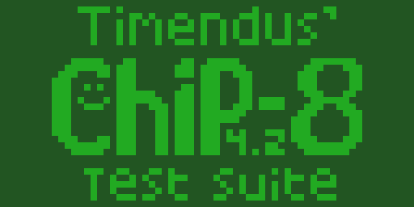
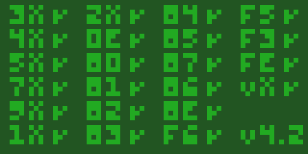
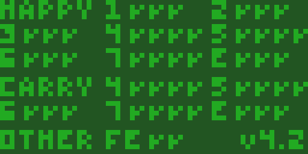
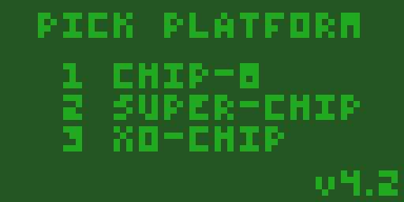
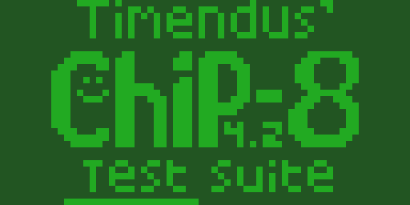
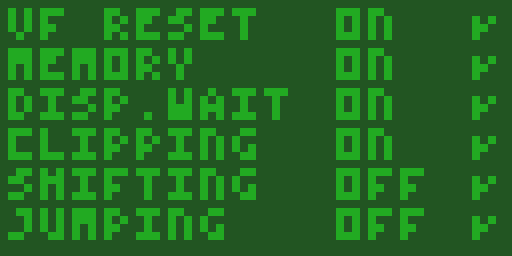
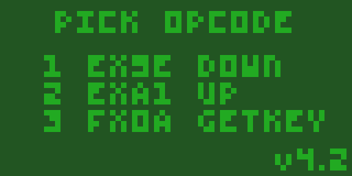

# Chip8 emulator

## not implemented
- sound timer
- font memory
- wait key is on pressed and not released

## screenshot
### Display chip8 logo

### Display IBM logo

### Test instruction

### Test flags

### Test quirks
rom that test implementation quirks

### Test key
rom that test key pressed

